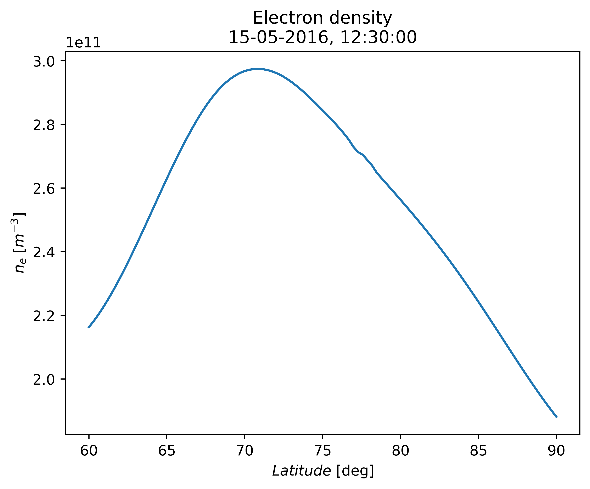

Latitude profile of electron density
------------------------------------

.. code-block::

    import numpy as np
    from datetime import datetime
    import matplotlib.pyplot as plt

    from src.echaim import density_path

    # Defining date of observation
    dt = datetime(year=2016, month=5, day=15, hour=12, minute=30)

    # Defining coordinate of observation
    ncoords = 100
    lats = np.linspace(60, 90, ncoords)
    # Using constant longitude (not necessarily)
    lons = np.zeros(ncoords) - 75
    # Using constant altitude (not necessarily)
    alts = np.zeros(ncoords) + 250

    dens_path = density_path(lats, lons, alts, dt, True, True, True)

    plt.plot(lats, dens_path)
    plt.title("Electron density\n" + dt.strftime("%d-%m-%Y, %H:%M:%S"))
    plt.ylabel(r"$n_e$ [$m^{-3}$]")
    plt.xlabel(r"$Latitude$ [deg]")
    plt.show()

