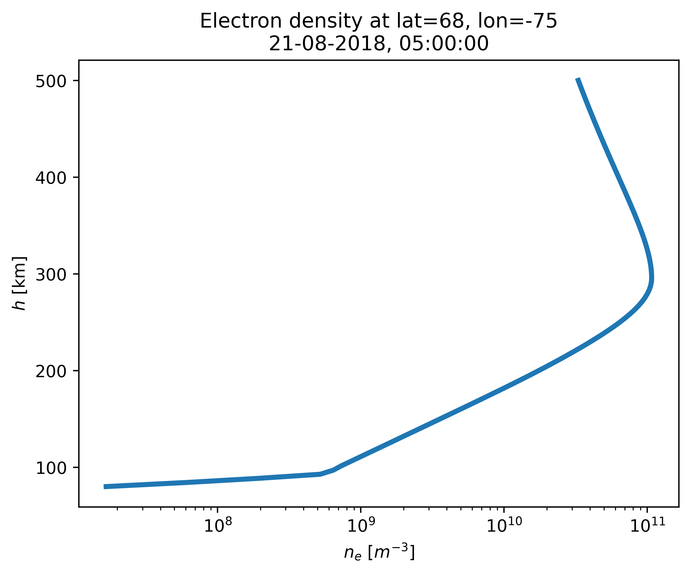

Altitude profile of electron density
------------------------------------

.. code-block::

    import numpy as np
    from datetime import datetime
    import matplotlib.pyplot as plt

    from echaim import density_profile

    # Defining date of observation
    dt = datetime(year=2018, month=8, day=21, hour=5)

    # Defining coordinate of observation - echaim.density_profile accepts
    # only np.ndarray as input for coordinates
    lats = np.array([68])
    lons = np.array([-75])
    alts = np.linspace(80, 500, 100)

    # Using [0] index because density_profile returns 2D array,
    # and we use only single coordinate point
    altprof = density_profile(lats, lons, alts, dt, storm=True, precip=True, dregion=True)[0]

    plt.semilogx(altprof, alts, lw=3)
    plt.title(f"Electron density at lat={lats[0]}, lon={lons[0]}\n" +
              dt.strftime("%d-%m-%Y, %H:%M:%S"))
    plt.xlabel(r"$n_e$ [$m^{-3}$]")
    plt.ylabel(r"$h$ [km]")
    plt.show()

