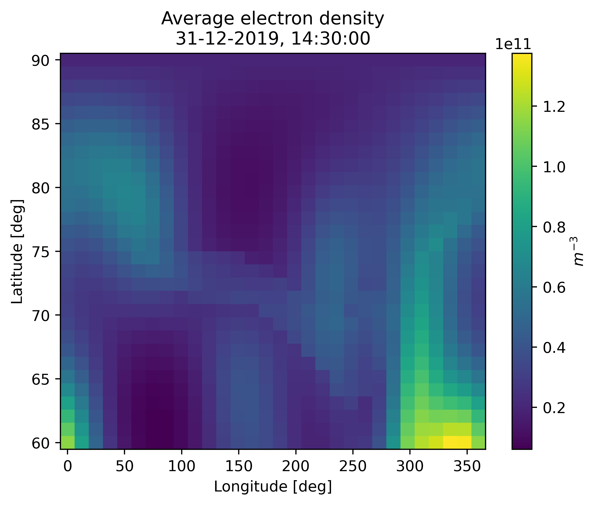

Map of average electron density
-------------------------------

.. code-block::

    import numpy as np
    from datetime import datetime
    import matplotlib.pyplot as plt

    from echaim import density_profile

    # Defining date of observation
    dt = datetime(year=2019, month=12, day=31, hour=14, minute=30)

    # Defining coordinate of observation
    ncoords = 50
    lats = np.linspace(60, 90, ncoords)
    lons = np.linspace(0, 360, ncoords)

    # Since echaim.density_profile accepts only 1D arrays for coordinates,
    # we will need to create a mesh grid of latitudes and longitudes and
    # then flatten them in order to calculate a map
    lats_mesh, lons_mesh = np.meshgrid(lats, lons)
    lats_flatten = lats_mesh.flatten()
    lons_flatten = lons_mesh.flatten()

    # Array of altitudes
    alts = np.linspace(150, 500, 50)

    # This will take a while
    dens_map = density_profile(lats_flatten, lons_flatten, alts, dt, True, True, True)
    # Restoring mesh shape
    dens_map = dens_map.reshape((ncoords, ncoords, len(alts)))
    # Calculating average density at each coordinate
    aver_dens_map = dens_map.mean(axis=2)

    pmesh = plt.pcolormesh(lons_mesh, lats_mesh, aver_dens_map)
    plt.colorbar(pmesh, label=r"$m^{-3}$")
    plt.xlabel("Longitude [deg]")
    plt.ylabel("Latitude [deg]")
    plt.title("Average electron density\n" + dt.strftime("%d-%m-%Y, %H:%M:%S"))
    plt.show()

