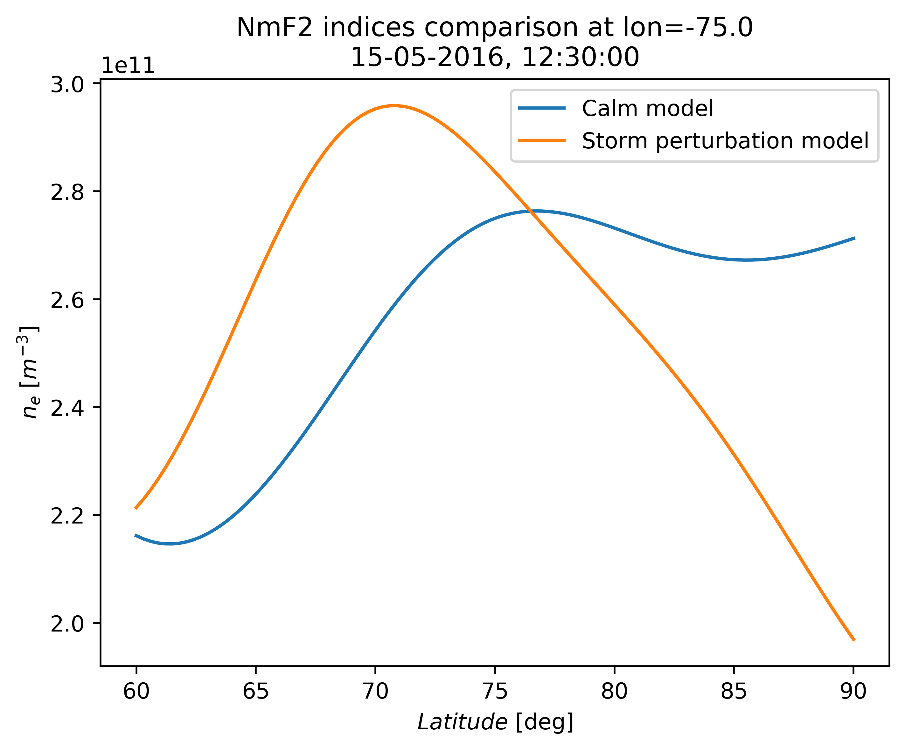

NmF2 models comparison
----------------------

.. code-block::

    import numpy as np
    from datetime import datetime
    import matplotlib.pyplot as plt

    from src.echaim import nmf2, nmf2_storm

    # Defining date of observation
    dt = datetime(year=2016, month=5, day=15, hour=12, minute=30)

    # Defining coordinate of observation
    ncoords = 100
    lats = np.linspace(60, 90, ncoords)
    # Constant longitude (not necessarily)
    lons = np.zeros(ncoords) - 75

    NmF2 = nmf2(lats, lons, dt)
    NmF2_storm = nmf2_storm(lats, lons, dt)

    plt.plot(lats, NmF2, label="Calm model")
    plt.plot(lats, NmF2_storm, label="Storm perturbation model")
    plt.legend()
    plt.title(f"NmF2 indices comparison at lon={lons[0]}\n" + dt.strftime("%d-%m-%Y, %H:%M:%S"))
    plt.ylabel(r"$n_e$ [$m^{-3}$]")
    plt.xlabel(r"$Latitude$ [deg]")
    plt.show()

